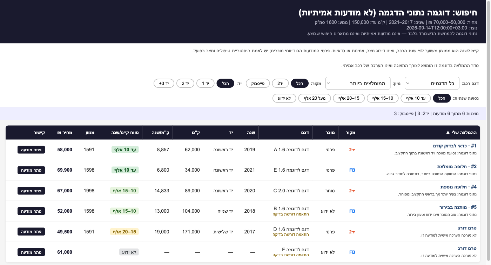
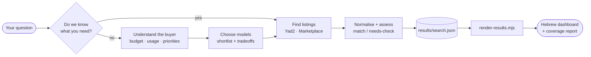

<div align="center">

# 🚗 Car Lookup

**An agent skill for buying a used car in Israel.**

Figure out which car actually fits your life and budget, then compare real
Yad2 and Facebook Marketplace listings in an offline, sortable Hebrew dashboard.

[](.agents/skills/car-lookup/SKILL.md)
[](scripts/render-results.mjs)
[](scripts/render-results.mjs)
[](template/results.html)
[](#-sources)

</div>

<div align="center">



<sub>⚠️ Sample data for illustration only — these are not real listings.</sub>

</div>

---

## ✨ What it does

|  | |
|---|---|
| 🧭 **Learns what you need** | Budget ceiling, driving profile, passengers, parking, priorities — asked a few questions at a time, not as a questionnaire |
| 🔍 **Shortlists models** | Researches candidates against *your* needs with live sources, showing tradeoffs and what still needs checking |
| 🛒 **Finds listings** | Searches Yad2 and Facebook Marketplace, opens candidate ads, and extracts the labelled details |
| 📊 **Builds a dashboard** | One self-contained Hebrew HTML file: ranked shortlist, filters, sortable columns, expandable details |
| 🧾 **Reports its coverage** | Exact filters applied, pages visited, blocked sources, and skipped listings — no invented completeness |

## 🚀 Quick start

Open this repository in your agent and just ask. The skill is available in both
[Codex](https://learn.chatgpt.com/docs/build-skills) and Claude Code.

<table>
<tr><th align="left">Codex</th><th align="left">Claude Code</th></tr>
<tr valign="top">
<td>

```text
$car-lookup Help me find a car
suitable for me.
```

</td>
<td>

```text
/car-lookup Help me find a car
suitable for me.
```

</td>
</tr>
</table>

Already know what you're looking for? Skip straight to the search:

```text
$car-lookup Find Toyota Corolla listings up to ₪70,000 near Haifa.
```

> [!NOTE]
> Those are examples, **not** saved preferences. The skill asks about your own
> budget, location, and priorities when it doesn't know them yet — and records
> confirmed answers in `buyer-profile.local.md`, which stays out of Git.

## 🔄 How it works



The three stages are modes, not a fixed pipeline — a specific listing query
doesn't re-open a needs discussion you've already had.

## 📊 The dashboard

Rendered from a saved search into a single offline HTML file — no server, no
build step, no network calls:

```bash
node scripts/render-results.mjs results/search.json results/search.html
open results/search.html
```

- **Ranked shortlist** — each assessed ad carries the agent's priority, its rank, and a one-line reason; unassessed ads sort last as `טרם דורג`
- **Filters** — model, source, ownership count (יד), annual-mileage band
- **Sorting** — presets (most recommended, price, year, mileage) plus every column, with nulls sorted last instead of as zero
- **Details** — click a row for location, observation time, seller notes, description
- **Honest gaps** — missing fields stay `—`; unverified matches are flagged `התאמה דורשת בדיקה`
- **Safe by default** — listing text is escaped, only `http(s)` links render, and the renderer refuses to overwrite an existing file

The input shape is documented in
[the listing reference](.agents/skills/car-lookup/references/listings.md):

```jsonc
{
  "meta":     { "make": "…", "model": "…", "priceMax": 70000,
                "coverage": "…", "recommendationMethod": "…" },
  "listings": [{ "source": "yad2", "href": "https://…", "modelGroup": "…",
                 "year": 2019, "km": 62000, "hand": 1, "price": 58000,
                 "matchStatus": "match", "notes": "…",
                 "recommendationPriority": 1, "recommendationRank": 1,
                 "recommendationReason": "…" }]
}
```

## 🗂 Repository layout

```
.agents/skills/car-lookup/
├── SKILL.md              # canonical skill — the whole workflow
├── references/
│   └── listings.md       # source mechanics, normalisation, report format
└── agents/openai.yaml    # Codex skill-picker metadata
.claude/skills/
└── car-lookup.md         # Claude Code entry → points at the same skill
template/results.html     # self-contained dashboard, JSON placeholders
scripts/render-results.mjs # renderer, Node built-ins only
docs/superpowers/         # historical Claude v1 design + plan (not current)
results/                  # your searches and generated HTML — Git-ignored
buyer-profile.local.md    # your preferences — Git-ignored
AGENTS.md                 # project context for agents
```

## 🌐 Sources

| Source | Notes |
|---|---|
| [Yad2](https://www.yad2.co.il/vehicles/cars) | Filters are selected in the UI and verified live; pagination is followed as observed, never guessed |
| [Facebook Marketplace](https://www.facebook.com/marketplace/) | May require a logged-in browser; search filters can differ from the ones requested, so results are re-checked after extraction |

## ⚖️ Ground rules

This is an **assistant-driven search, not an unattended scraper**, and it is
built to stay honest about what it actually saw:

- A blocked page is reported as a blocked page — never as "no cars found".
- Synthetic listings are never substituted for missing results.
- Seller claims stay separate from verified facts.
- **ק״מ/שנה is a descriptive average**, not a score for condition, reliability,
  or value.
- Preparing questions for a seller does not mean sending them — contacting
  sellers stays your call.
- Your search data and buyer profile never leave your machine.

Always verify current prices, availability, local specifications, and recalls
against live sources before committing money. A low annualised mileage proves
nothing on its own; an independent inspection still does.

## 📚 Further reading

- [`.agents/skills/car-lookup/SKILL.md`](.agents/skills/car-lookup/SKILL.md) — the workflow itself
- [`.agents/skills/car-lookup/references/listings.md`](.agents/skills/car-lookup/references/listings.md) — collection, normalisation, and reporting rules
- [`AGENTS.md`](AGENTS.md) — repository conventions for agents
- [`docs/superpowers/`](docs/superpowers/) — the original Claude v1 design and plan, kept for history
